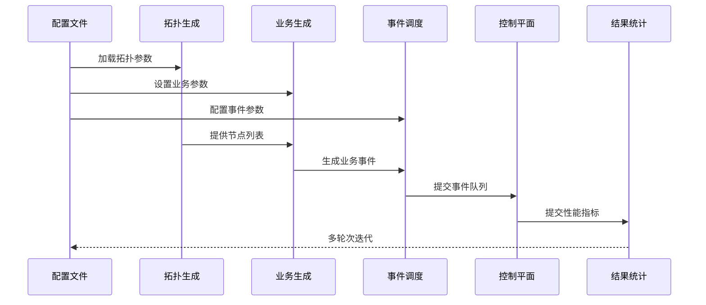
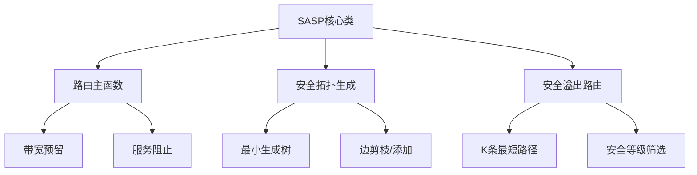

# 离散事件仿真：部分安全光网络中业务路由方法

## 系统概述​​
该仿真系统是一个基于离散事件驱动的网络仿真平台，用于模拟网络攻击、业务调度和路由策略。系统通过配置文件驱动，支持拓扑构建、业务生成、事件调度和结果分析全流程。

## 模块设计​​
### 配置解析模块​

```python
configer: configparser.ConfigParser
```

- 解析INI格式配置文件

- 转换配置值为合适数据类型
- 提供各模块的初始化参数

### 拓扑生成模块​

```python
topo_gen = network.generator.TopoGen()
```

从GML/GraphML文件加载基础拓扑
批量设置节点/链路属性（带宽、延迟等）
可选拓扑可视化（基于地理坐标）

### 业务生成模块​
```python
tfc_gen = network.generator.CallsGen()
```

- 基于节点列表生成随机源-目的对
- 指定呼叫数量和速率参数
- 调用静态SPF算法预计算路由

### 事件调度模块

```python
scheduler = network.scheduler.Scheduler()
atk_gen = network.generator.EventGen()
```

- 基于指数分布生成攻击事件时间序列
- 创建事件对（到达/离开）
- 维护事件优先级队列（按时间排序）

### 控制平面模块

```python
controller = network.controller.ControlPlane()
```

- 驱动事件处理主循环
- 协调拓扑、业务、状态更新
- 执行路由算法决策
- 收集性能指标数据

### 结果统计模块

```python
res = result.statistic.Statistic()
```

- 收集每轮仿真性能指标
- 计算多轮次平均结果
- 生成置信区间（99%置信水平）
- 支持数据可视化输出

## 数据流



## 算法

### SASP (Security Aware Service Provision) 



#### **路由主函数 (`route()`)**

- **工作流程**：
  1. 解析服务请求（源/目的节点、带宽、安全等级）
  2. 构建安全拓扑（首次调用时）
  3. 执行安全感知路由（默认使用Security Overflow算法）
  4. 成功时预留带宽 / 失败时阻止服务
- **关键参数**：
  - `method`：可扩展的路由算法选择器（支持自定义路由策略）
